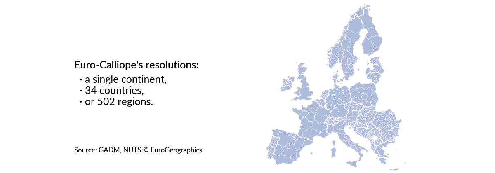

# Euro-Calliope v1.2.0.dev

Models of the European electricity system for _Calliope_.

Euro-Calliope is a suite of pre-built models and routines to build these models from raw data.
You can configure, adapt, and extend both models and routines in many ways to build your own model that is fit for your purpose.

## At a glance

Euro-Calliope models the European electricity system with each location representing an administrative unit.
It is built on four spatial resolutions: on the `continental` level as a single location, on the `national` level with 34 locations, on the `ehighways` resolution with 97 locations, and on the `regional` level with 497 locations.
At each location, renewable generation capacities (wind, solar, bioenergy) and balancing capacities (battery, hydrogen) can be built.
In addition, hydro electricity and pumped hydro storage capacities can be built up to the extent to which they exist today, and nuclear capacity can be built in certain countries.
All capacities are used to satisfy electricity demand on all locations where demand is based on historic data.
Locations are connected through transmission lines of either unrestricted capacity or projections.
Using [Calliope](https://www.callio.pe), the model is formulated as a linear optimisation problem with total monetary cost of all capacities as the minimisation objective.
Due to the flexibility of Calliope and the availability of the routines building the model all components can be adapted to the modeller's needs.

!!! info "What is the `ehighways` spatial resolution?"

    The [e-Highway 2050 project](https://cordis.europa.eu/project/id/308908/reporting) was a pan-European collaboration between research institutes and energy transmission system operators.
    The (mostly) subnational regions defined in their model were created in consultation with transmission system operators.
    As part of the project, effective net-transfer capacities (NTCs) between regions were calculated.
    By including these regions as a spatial resolution in Euro-Calliope, we can use the e-Highway 2050 NTCs to define lower bounds on a subnational electricity transmission system.
    The partial sub-nationalisation also leads to a compromise between representing Europe's spatial diversity and ensuring computational tractability of our models.

## Where to start?

**Quickstart using the pre-built models**:
The easiest and quickest way to start using Euro-Calliope is by downloading and running our pre-built models.
These models are readily available Calliope models that you can adapt and extend using Calliope's mechanisms.
To use our pre-builts you need no prior knowledge in using Calliope but you should have some or expert knowledge in modelling energy systems.
[Learn more about using the pre-built models.](./model/pre-built.md)

**All customisation options using your own builds**:
When you require more flexibility in adapting or extending the models than Calliope's built-in mechanisms can provide, you can build Euro-Calliope models from raw data.
This process is fully automated and we provide all necessary routines that we use to generate the pre-built models.
By building the models yourself, you have many more options to configure, extend, and adapt the models.
You should have some or expert knowledge in scientific workflows and execution environments, or be willing to learn about those.
Building the models will require to download several gigabytes of raw data and a few hours of compute time on a regular personal computer.
[Learn more about using your own builds.](./workflow/build.md)
