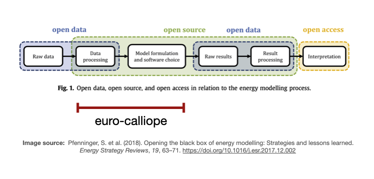

# Workflow overview

Euro-Calliope's workflow builds the models from raw data.
In essence, it is composed out of three things: scripts that retrieve raw data, process data, and formulate the model; execution environments that explicitly define software dependencies and requirements (equivalent to the conditions in a lab); and the glue ensuring all scripts run in the correct execution environment and the right order.
Scripts are written in Python; the execution environments are [conda environments](https://docs.conda.io/en/latest/); and the glue holding everything together is the workflow management system [Snakemake](https://snakemake.readthedocs.io/en/v6.1.1/).

## Rationale

"Wait! Why all this workflow wizardry?" you may ask.
The purpose of Euro-Calliope is to automatically build models out of raw data, as you can see in the image below.
Automation is key for traceability, reproducibility, and adaptability.

Automation makes models **traceable** because everyone can look up all the steps necessary to build the models.
While manual steps are traceable when they are documented properly, in practice, it is just too easy to forget to document one step or to forget to update the documentation.
Euro-Calliope's workflow does not contain any manual steps.
In that sense, the workflow is the most comprehensive methods section of any study building on Euro-Calliope.
One may have to dig to discover modelling decisions.
One may have to dig deep and one may get dirty hands in the process.
Either way, one will find the answer in the workflow.
Nothing is hidden.

Automation makes models **reproducible**.
While having scripts makes the models traceable, with only scripts one may not be able to build the exact same model.
That is because the execution environment may be different to the one that has been used to build the model one is comparing to.
To overcome this, our workflow contains textual descriptions of the execution environments that one can use to reproduce the execution environment (aside from caveats when reproducing conda environments) which, in turn and in combination with the scripts, one can use to reproduce the models.
This way, everyone can ensure that the workflow does indeed build the models it is claiming it does.

Automation makes the models **adaptable**, as one can not only reproduce the exact same model but one can also [customise and configure](./customisation.md) the workflow so that it builds a different variant of the model that fits better for ones purpose.

## Workflow steps

The image below shows all steps in Euro-Calliope's workflow and their connections.
Connected, they form a directed acyclic graph (DAG) -- a sort of data pipeline from raw data at the top of the graph to the final model at the bottom of the graph.
Most steps at the top of the graph download raw data from the source.
At the bottom, there are three final steps: model, test, and all.
In the _model_ step, the models are composed out of all their components.
In the _test_ step, the models are tested through a set of test routines.
The final step _all_ is a Snakemake specificity and exists only to ensure the model and built steps ran through successfully.

Some of the steps run more than once, but this hidden in the visualisation below. For example, the _model_ step runs three times: once for each model resolution continental, national, and regional.

{: id="dag" }

## Folder structure

When you have downloaded or cloned the workflow, you will have a set of files in front of you. Most of these files represent either scripts, execution environments, or the glue that brings everything together. Here's an an overview over the most important folders and their content.

* `build/model`: Contains the entire model after the build step, including Calliope definition files and data (does not exist initially).
* `config`: Files with configuration parameters that customise the model build process.
* `data/automatic`: Contains data automatically downloaded from third-party sources within the model build process (does not exist initially).
* `docs`: Documentation of the model and the build process.
* `envs`: Files defining the conda environments that are used to build the model.
* `lib`: Library code in form of a Python package that is reused in many places of this repository.
* `profiles`: Snakemake profiles used to control execution on different machines.
* `rules`: Snakemake files defining the build process.
* `scripts`: Scripts that preprocess data and build the model components.
* `templates`: Templates of Calliope model files.
* `tests`: Tests of the models, scripts, and library code.
